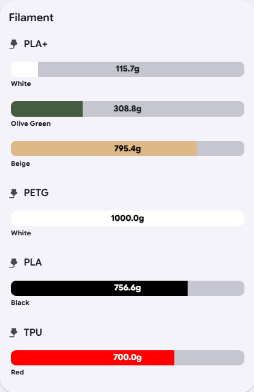
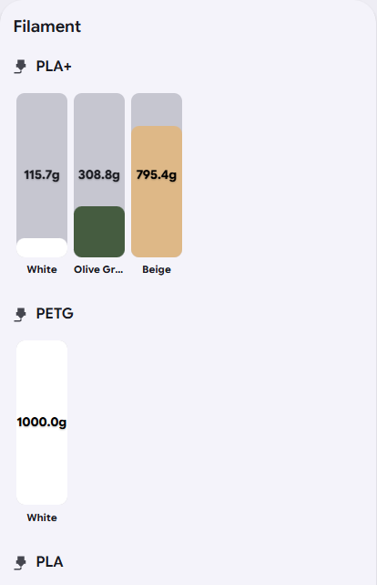

<table>
<tr>
<td width="140">


</td>
<td>

# Filament Card

</td>
</tr>
</table>

A modern and highly configurable Home Assistant Lovelace card for
visualizing **filament**, **consumables**, and other resource-based
entities.

Originally built for **Spoolman**, the card has evolved into a flexible
visualization card supporting multiple presets, rich customization, and
the full Home Assistant action model.


[](https://hacs.xyz/)
[](https://github.com/kimzeuner/Filament-Card/blob/main/LICENSE)
[](https://www.paypal.me/KZeuner)

 

------------------------------------------------------------------------

# ✨ Features

## Spoolman

-   Automatic discovery of Spoolman filament entities
-   Dynamic maximum weight from `filament_weight`
-   Material, Color, Vendor or no grouping
-   Custom group ordering
-   Per spool actions
-   Group title icons, colors and actions
-   Optional filament colors
-   Hide archived spools

## Custom Presets

-   **Custom Attributes**
-   **Custom Multiple Entities**
-   Planned **Home Assistant Label** preset

## Appearance

-   Vertical and horizontal bars
-   Configurable name/value positions
-   Group titles
-   Automatic text color
-   Home Assistant theme support

## Actions

Supports the native Home Assistant action model: - Tap - Double Tap -
Hold

Supported actions: - More Info - Navigate - URL - Call Service -
Assist - None

------------------------------------------------------------------------

# 📦 Installation

## HACS

1.  Open HACS
2.  Add this repository as a Custom Repository
3.  Install **Filament Card**
4.  Restart Home Assistant
5.  Refresh your browser

------------------------------------------------------------------------

# 🚀 Presets

## Spoolman

``` yaml
type: custom:filament-card
preset: spoolman
```

Automatically discovers all Spoolman entities.

## Custom Attributes

Entities expose all required information through attributes.

``` yaml
type: custom:filament-card

preset: custom_attributes

custom_attribute_entities:
  - sensor.pla_black
  - sensor.petg_white
```

Supported attributes:

  Attribute                  Description
  -------------------------- ---------------
  friendly_name              Display name
  group                      Group
  vendor                     Vendor
  color                      Bar color
  max_value                  Maximum
  unit                       Unit
  value / remaining_weight   Current value

## Custom Multiple Entities

``` yaml
type: custom:filament-card

preset: custom_entities

custom_items:
  - name: PLA Black
    value_entity: sensor.pla_black_remaining
    max_entity: sensor.pla_black_capacity
    color_entity: sensor.pla_black_color
    group_entity: sensor.pla_black_group
```

------------------------------------------------------------------------

# 🖱 Actions

Global actions:

``` yaml
tap_action:
  action: navigate
  navigation_path: /dashboard-test/filament
```

Per Spool (Spoolman):

``` yaml
spool_actions:
  sensor.spoolman_pla_black:
    tap_action:
      action: navigate
      navigation_path: /dashboard-test/pla
```

Per Custom Item:

``` yaml
custom_items:
  - name: PLA
    value_entity: sensor.pla
    tap_action:
      action: more-info
```

------------------------------------------------------------------------

# 🎨 Group Title Overrides

Configure group titles individually.

``` yaml
group_title_icons:
  PLA: mdi:printer-3d-nozzle
  PETG: mdi:water

group_title_colors:
  PLA: "#4caf50"

group_title_actions:
  PLA:
    tap_action:
      action: navigate
      navigation_path: /dashboard-test/pla
```

Supported: - Icons - Colors - Tap / Double Tap / Hold actions

------------------------------------------------------------------------

# ⚙ Common Options

  Option                 Default
  ---------------------- -----------------------
  title                  Filament
  preset                 spoolman
  group_by               material
  group_order            \[\]
  group_sort_by          name
  group_sort_direction   asc
  sort_by                remaining_weight
  sort_direction         asc
  bar_direction          vertical
  name_position          bottom
  value_position         center
  show_name              true
  show_group_title       true
  group_icon             mdi:printer-3d-nozzle
  use_filament_color     true

------------------------------------------------------------------------

# 🧩 Visual Editor

The editor supports:

-   Preset selection
-   Entity Picker
-   Icon Picker
-   Native Home Assistant action editor
-   Collapsible sections
-   Group Title Overrides
-   Automatic group detection

------------------------------------------------------------------------

# 📋 Examples

Minimal:

``` yaml
type: custom:filament-card
```

Spoolman:

``` yaml
type: custom:filament-card
preset: spoolman
group_by: material
```

Custom Attributes:

``` yaml
type: custom:filament-card
preset: custom_attributes

custom_attribute_entities:
  - sensor.pla_black
```

Custom Multiple Entities:

``` yaml
type: custom:filament-card
preset: custom_entities

custom_items:
  - name: PLA Black
    value_entity: sensor.pla_black_remaining
```

------------------------------------------------------------------------

# 🛣 Roadmap

## Completed

-   ✅ Spoolman preset
-   ✅ Custom Attributes preset
-   ✅ Custom Multiple Entities preset
-   ✅ Per spool actions
-   ✅ Group title icons
-   ✅ Group title colors
-   ✅ Group title actions
-   ✅ Visual editor
-   ✅ Native HA actions

## Planned

-   Home Assistant Label preset
-   Localization
-   Statistics mode
-   Additional display styles

------------------------------------------------------------------------

# 🤝 Contributing

Contributions, feature requests and bug reports are welcome.

Please use the GitHub issue tracker.

------------------------------------------------------------------------

# 📄 License

MIT

Inspired by **Spoolman** and built for the Home Assistant community.
